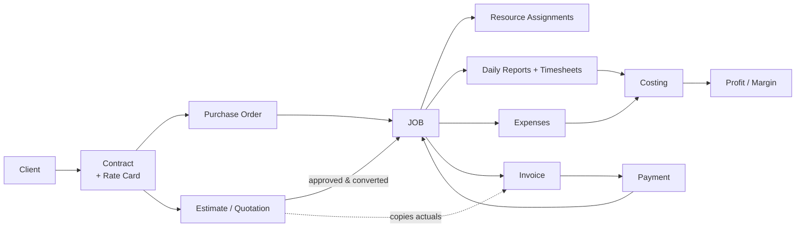

# 00 — The Idea & Business Domain

[← Index](README.md) · [Next: Tech Stack →](01-tech-stack.md)

---

## 1. Who is Abrican?

**Abrican** is a **Saudi-based oil-and-gas / industrial-services contractor** — the
kind of company that sends crews, vehicles, and specialised equipment out to field
sites to perform work for large enterprise clients. Its biggest customer is
**Saudi Aramco** (Abrican is an Aramco *vendor*), alongside clients like **SABIC**
and **Alkhorayef Petroleum** (these appear as seed data in the system).

The work it does are **service lines** such as: pipeline services, coating &
hydro-testing, mechanical/fitting work, welding, pigging, chemical injection, and
manpower/crew supply — typically billed by man-hours, equipment-hours, day rates,
or lump sums, all in **Saudi Riyals (SAR)** with **15% VAT**.

> Source of truth for the business vision: [`../../abrican_erp_srs_full_prompt.md`](../../abrican_erp_srs_full_prompt.md)
> (a 2,854-line SRS), and the sprint roadmap in [`../../PHASE2.md`](../../PHASE2.md).

---

## 2. The problem it solves

Before this system, a company like Abrican runs on **spreadsheets and paper**:
one Excel file for the fleet, another for the Aramco contract rate card, a
WhatsApp thread for who's assigned where, a shoebox of receipts for expenses, and
a manual invoice template. That works until it doesn't — you can't answer basic
questions quickly:

- **Operational:** Which jobs are active or delayed right now? Which crews,
  vehicles, or equipment are idle vs. over-booked? Whose driving licence /
  vehicle registration / Aramco sticker expires next week?
- **Financial:** Which jobs actually made a profit? Which invoices are unpaid and
  how overdue? Are our costs creeping above budget on a job?
- **Compliance:** Are we within the purchase-order limit? Is the invoice ZATCA-
  compliant (Saudi e-invoicing)? Are documents expiring?

Abrican ERP replaces the spreadsheets with **one source of truth** and turns it
into an **operations-to-finance control system** — not just accounting, but a
diagnostic layer (dashboards + alerts) over the whole operation.

---

## 3. The heart of the system: **the Job**

If you remember one thing, remember this: **everything revolves around the Job.**
A Job is one real operational engagement for a client. The entire system is the
**"job-to-cash" chain** wrapped around that object:

Read it as a sentence:

> A **client** signs a **contract** (with a **rate card** of agreed prices) and
> issues a **purchase order** (a spending limit). We quote the work as an
> **estimate**; when approved it **converts into a job**. We **assign** people,
> crews, vehicles, and equipment to the job, capture **daily reports** and
> **timesheets** from the field, and log **expenses**. From approved timesheets +
> assignment hours + posted expenses we compute the job's **actual cost** and
> **profit**. We **invoice** the client (consuming the PO), record **payments**,
> and the job walks through its financial statuses until it's **paid** and **closed**.

Every chapter after this is just a detailed zoom into one link of that chain.

---

## 4. Goals of the system

From the SRS executive summary, the system exists to deliver:

1. **Operational visibility** — real-time answer to "what's happening in the field".
2. **Financial diagnostics** — profitability per job, receivables, cost trends.
3. **Compliance** — VAT/ZATCA invoicing, PO limits, document/licence expiry tracking.
4. **One source of truth** — eliminate the parallel Excel workflows.

Design philosophy: it is a **control system**, not a ledger. It watches the
operation and raises **alerts** (PO nearly consumed, margin below target, invoice
overdue) rather than just recording numbers after the fact.

---

## 5. Scope — what's in, what's deliberately out

**In scope (built):** clients/contracts/POs, jobs + lifecycle, resource
management & scheduling, field reports/timesheets, expenses, estimating,
invoicing (with ZATCA **Phase-1** QR), payments/receivables, job costing &
profitability, operations + finance dashboards, alerts, RBAC, audit, MFA.

**Explicitly out of scope (by design, for now):** full payroll, a general
ledger / double-entry accounting, complex multi-jurisdiction tax, live Aramco
portal automation, a native mobile app, AI forecasting, multi-tenant SaaS,
IoT/GPS telematics, and ZATCA **Phase-2** live e-invoicing. The architecture is
meant to *allow* these later — they just aren't built. See
[`10-concerns-risks.md`](10-concerns-risks.md) for the full deferred list.

---

## 6. How it was built (the timeline)

The system was built in two phases, sprint by sprint. You can literally see the
timeline in the database migrations (`backend/prisma/migrations/`), whose
datestamps mark each major addition.

### Phase 1 — Foundation & operational core (complete)
- **S1** Auth, users, roles (RBAC), audit log, notifications.
- **S2** Clients, contracts (+ rate cards), purchase orders.
- **S3** Jobs + the status state machine.
- **S4** Employees, crews, vehicles, equipment.
- **S5** Assignments & scheduling — polymorphic assignment, conflict detection,
  override, utilization, bulk assign.
- **S6** Documents (upload + expiry) and the operations/assets dashboards.

### Phase 2 — Finance (complete, S7–S13, landed 2026-07-05)
- **S7** Estimates / quotations (priced from rate cards; quotation PDF; convert to job).
- **S8** Invoicing (from estimate actuals; 15% VAT; PO-balance check; ZATCA Phase-1 QR).
- **S9** Payments, receivables, AR aging.
- **S10** Daily reports & timesheets (approval workflow).
- **S11** Expenses (categories, allocation, receipts, reimbursement track).
- **S12** Job costing & profitability (the actual profit feature).
- **S13** Finance dashboard + critical finance alerts.

### Hardening & polish passes (after the features)
- **Auth hardening** (password policy, lockout, refresh-token reuse detection).
- **Account security** (TOTP MFA, force-password-change, session management).
- **Pentest** — 8 findings, all fixed (see [`04-auth-security.md`](04-auth-security.md)).
- **Logic sweep** — findings F-001…F-012, all closed (see [`07-edge-cases.md`](07-edge-cases.md)).
- **UI polish** — theme, layout, dashboards (the `ui-polish` branch).
- **Self-hosting pack** — TLS + LAN/VPN deployment runbook (see [`09-deployment.md`](09-deployment.md)).

### The migration timeline (proof of the above)
| Migration | What it added |
|---|---|
| `20260611124447_init` | Core schema (Phase 1) |
| `20260611124454_add_polymorphic_check_constraints` | Exactly-one-FK guards for assignments/documents |
| `20260615114913_auth_hardening` | Lockout + MFA fields |
| `20260617083930_phase2_finance` | Estimates, invoices, line items, payments |
| `20260618084831_account_security` | Password/session security fields |
| `20260618093300_field_reports_timesheets` | Daily reports + timesheets (S10) |
| `20260618114050_expenses` | Expenses + reimbursement (S11) |
| `20260622102841_vehicle_fleet_fields` | Real fleet fields (Arabic plate, Aramco sticker, etc.) |
| `20260705113208_finance_alert_notifications` | Finance alert notification types (S13) |
| `20260708081521_invoice_number_at_issue` | Invoice number assigned at issue, not draft (F-012) |

That's **10 migrations** — the schema's whole history.

---

[← Index](README.md) · [Next: Tech Stack →](01-tech-stack.md)
