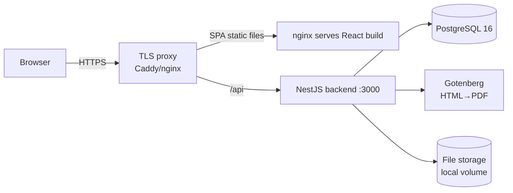
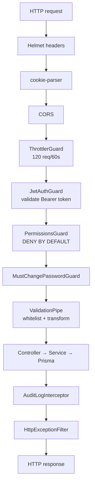

# 02 — Architecture

[← Tech Stack](01-tech-stack.md) · [Index](README.md) · [Next: Data Model →](03-data-model.md)

---

## 1. The shape: a modular monolith + a SPA

Two deployable pieces:

1. **Backend** — one NestJS application (a **modular monolith**: many feature
   modules, one process, one database). Not microservices. Exposes a REST API
   under `/api/v1`.
2. **Frontend** — a React single-page app (SPA) that talks to that API.

Plus one helper process (**Gotenberg**) for PDF rendering, and PostgreSQL for storage.

> **Why a monolith?** A solo developer + a bounded domain. One codebase, one deploy,
> one DB transaction boundary. The *modules* keep it organised; you get separation
> without the operational tax of microservices. The deeper rationale is in
> [`../../ARCHITECTURE.md`](../../ARCHITECTURE.md).

---

## 2. Runtime topology (same-origin)

In production everything is served **same-origin**: the browser only ever talks to
one host. nginx serves the built SPA *and* proxies `/api` to the backend, so there
are no cross-origin cookie problems. The database and backend are never exposed
publicly.



In **local dev** the two run separately: Vite on `:5173`, backend on `:3000`, and
Vite proxies `/api` to the backend. Same code, looser wiring. Deployment specifics
are in [`09-deployment.md`](09-deployment.md).

---

## 3. Backend request lifecycle

Every request passes through a fixed chain before it reaches your controller. This
chain **is** the security model — understand it and you understand how access works.



The four **global guards**, in order (registered in `backend/src/app.module.ts`):

1. **ThrottlerGuard** — rate limiting (120/min globally; some endpoints tighter).
2. **JwtAuthGuard** — validates the JWT access token, unless the route is `@Public()`.
3. **PermissionsGuard** — **deny-by-default**. A route must declare one of
   `@Public()`, `@AuthOnly()`, or `@RequirePermissions('x.y')`. If it declares
   nothing, access is *refused* — you can't accidentally ship an unguarded route.
4. **MustChangePasswordGuard** — if the user has `mustChangePassword=true`, blocks
   everything except a whitelist of `@AllowDuringPasswordChange()` routes (me,
   logout, change-password).

Cross-cutting pieces:
- **ValidationPipe** (global) — strips unknown fields, rejects invalid DTOs, coerces types.
- **AuditLogInterceptor** — records mutations to the `AuditLog` table.
- **HttpExceptionFilter** — normalises error responses (no internal class leakage).

Auth details (JWT/refresh/MFA/RBAC) get their own chapter:
[`04-auth-security.md`](04-auth-security.md).

---

## 4. Backend code organisation

```
backend/src/
  main.ts              # bootstrap: /api/v1 prefix, CORS, helmet, ValidationPipe, Swagger(non-prod)
  app.module.ts        # wires all feature modules + the 4 global guards
  prisma/              # PrismaService (DB connection lifecycle) + schema + migrations + seed
  common/              # the shared toolbox (see below)
  <feature>/           # one folder per domain: controller + service + dto + *.spec.ts
```

There are **~29 feature modules** (auth, users, roles, clients, contracts,
purchase-orders, jobs, employees, crews, vehicles, equipment, assignments,
documents, audit-log, notifications, dashboard, estimates, invoices, payments,
daily-reports, timesheets, expenses, costing, finance-alerts, pdf, storage,
health, …). Each follows the same **controller → service → Prisma** shape and
ships with a `.service.spec.ts` unit test.

The **`common/` toolbox** (reused everywhere):
- **decorators:** `@Public`, `@AuthOnly`, `@RequirePermissions`, `@AllowDuringPasswordChange`, `@CurrentUser`, `@AuditEntity`
- **guards:** `JwtAuthGuard`, `PermissionsGuard`, `MustChangePasswordGuard`
- **interceptors:** `AuditLogInterceptor`
- **filters:** `HttpExceptionFilter`
- **finance:** `line-math.ts` (`computeLine`, `sumTotals`, `round2`, `DEFAULT_VAT_RATE=15`)
- **validators:** `is-strong-password.validator`
- **helpers:** pagination, duration, document-status
- **storage:** `IStorageService` — an **interface** over file storage, implemented
  today by a local-filesystem `StorageService`. Swap the implementation for S3 and
  nothing else changes. This is why receipts/PDFs/documents all "just work" without
  the domain code knowing where bytes live.

---

## 5. Frontend architecture

```
frontend/src/
  App.tsx              # Router + QueryClientProvider + AuthProvider + Toaster
  layout/
    AppLayout.tsx      # sidebar + topbar + <Outlet/>; blocks app if mustChangePassword
    ProtectedRoute.tsx # auth guard + per-route permission check → ForbiddenPage
    Sidebar.tsx        # 6 nav sections, permission-filtered
    nav-items.ts       # the nav model (label, path, icon, permission)
  pages/<domain>/      # one folder per feature (jobs, invoices, expenses, ...)
  components/          # DataTable, StatusBadge, dialogs, charts.tsx, ui/ (Radix wrappers)
  api/                 # one *.api.ts per domain + client.ts (axios instance)
  context/AuthContext  # user, login/logout, hasPermission
  lib/                 # formatters, api-error, job-status, open-blob, utils(cn)
  types/index.ts       # ~670 lines mirroring backend DTOs
```

**How it talks to the backend** (`api/client.ts`): a single axios instance with
`baseURL = VITE_API_BASE_URL` (default `/api/v1`), `withCredentials: true` for the
refresh cookie, a request interceptor that attaches the in-memory access token, and
a response interceptor that on `401` calls `/auth/refresh` once (deduped) and
retries — or redirects to `/login`. **The access token lives in memory, never in
localStorage** (XSS hardening); the refresh token is an HttpOnly cookie.

**State model:** there is almost no global client state. **Server state is
TanStack Query** (`['jobs']`, `['invoice', id]`, …) with `invalidateQueries` after
mutations. The only real context is **AuthContext** (current user + permission
helpers). Forms use React Hook Form + Zod locally.

**Money convention (memorise this):** the backend stores money as PostgreSQL
`Decimal`, which serialises **as a string over the wire** to avoid float error.
So invoice/estimate amounts arrive as **strings** and are converted with
`Number(...)` only for display/formatting (`formatCurrency` → `SAR 1,234.56`).
*Computed* aggregates from the backend (dashboard KPIs, costing totals) are already
rounded numbers. A consistency-audit check enforces that the frontend never
mistypes a Decimal field as `number`. More in [`03-data-model.md`](03-data-model.md).

**RBAC in the UI** happens three ways, all driven by the user's permission list:
1. **Route** — `<ProtectedRoute permission="jobs.view">` → `ForbiddenPage` if missing.
2. **Nav** — the sidebar filters out sections/items the user can't see.
3. **Actions** — `{hasPermission('invoices.approve') && <ApproveButton/>}`.

The UI is a *convenience* layer; the **backend re-checks every permission** — hiding
a button is never the security boundary.

---

[← Tech Stack](01-tech-stack.md) · [Index](README.md) · [Next: Data Model →](03-data-model.md)
