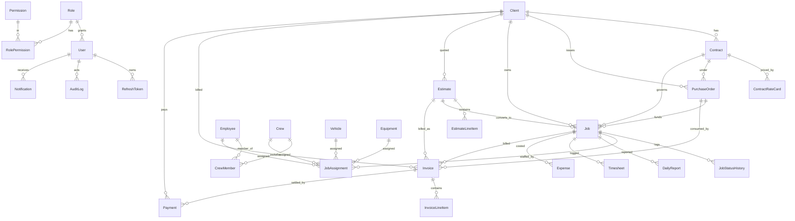

# 03 — Data Model

[← Architecture](02-architecture.md) · [Index](README.md) · [Next: Auth & Security →](04-auth-security.md)

---

The whole system is defined by one file: **`backend/prisma/schema.prisma`**. It
declares **29 models** (tables), **27 enums**, and its history is **10 migrations**.
This chapter is your map. (`SYSTEM-OVERVIEW.md` is the authoritative short form; this
is the teaching form.)

## 1. The entity-relationship picture

(Documents and audit relate to many entities polymorphically — see §5.)

---

## 2. Models by domain

Every model has a `uuid` primary key and (mostly) `createdAt`/`updatedAt`. Money is
`Decimal` — usually `Decimal(14,2)` for totals, smaller precisions for rates.

### Identity & access (4 + join)
- **User** — `email` (unique), `passwordHash`, `roleId`, `status`, plus security
  fields: `failedLoginAttempts`, `lockedUntil`, `mfaEnabled`, `mfaSecret`,
  `mustChangePassword`, `passwordChangedAt`.
- **RefreshToken** — `userId`, `tokenHash` (SHA-256, never plaintext), `expiresAt`,
  `revoked`, `userAgent`, `ipAddress`, `lastUsedAt`. This is the session table.
- **Role** — `name` (unique), `description`.
- **Permission** — `key` (unique). **RolePermission** — the many-to-many join.

### Clients, contracts, POs (5)
- **Client** — `name`, `clientType` (enum), `vatNumber`, `crNumber`,
  `billingAddress`, `paymentTermsDays`, `status`.
- **ClientContact** — people at the client (`name`, `role`, `phone`, `email`).
- **Contract** — `contractNumber` (unique), `contractValue`, `consumedValue`,
  `startDate`/`endDate`, `status`.
- **ContractRateCard** — the price list: `serviceLine`, `itemCode`, `description`,
  `unit`, **`unitPrice`** (the SELLING price), `vatApplicable`. Estimate & invoice
  lines reference these.
- **PurchaseOrder** — `poNumber` (unique), **`poValue`**, **`consumedAmount`**,
  `expiryDate`, `status`. The spending limit invoices draw down.

### Jobs (2)
- **Job** — the centre. `jobCode` (unique), `title`, client/contract/PO links,
  `serviceType`, `location`, `region`, planned/actual dates, `jobValue` (quoted),
  `costBudget`, `status` (the state machine), and the **profit fields** populated
  by S12: `actualCost`, `grossProfit`, `grossMarginPct`, `costReviewedAt/By`.
- **JobStatusHistory** — an append-only log of every status change (`fromStatus`,
  `toStatus`, `changedById`, `reason`).

### Resources (4 + join)
- **Employee** — `name`, `role`, `department`, **`costRate`** (SAR/hour, internal),
  `availabilityStatus`, `status`.
- **Crew** — a named team; `supervisorId` → Employee; `serviceCapability`, `status`.
- **CrewMember** — join (employee ↔ crew) with `startDate`/`endDate` so membership
  is time-bounded (costing respects this).
- **Vehicle** — the real fleet sheet: `plateNumber` (Latin, unique),
  **`plateNumberAr`** (Arabic), `doorNumber`, `vehicleClass` (LIGHT/HEAVY),
  make/model/year/color/plateColor, `ownershipType`, `status`, and a stack of
  compliance expiries: `registrationExpiry`, `insuranceExpiry`, `inspectionExpiry`
  (MVPI/Fahes), **`operatingCardExpiry`**, **`aramcoStickerExpiry`**, plus `costRate`.
- **Equipment** — `equipmentType`, `serialNumber`, `status`, `ownershipType`,
  `costRate`, `calibrationExpiry`, `maintenanceDueDate`.

### Assignments (1, polymorphic)
- **JobAssignment** — links a job to **exactly one** resource. `resourceType` enum
  + four nullable FKs (`employeeId`/`crewId`/`vehicleId`/`equipmentId`), a time
  window (`startDatetime`/`endDatetime`), `plannedHours`/`actualHours`, `status`,
  and **`overrideReason`** (set when a scheduling conflict was deliberately
  overridden). See §5 for the polymorphic pattern.

### Documents, audit, notifications (3)
- **Document** — polymorphic file record (`relatedEntityType` + one of
  employee/vehicle/equipment/contract/client), `documentType`, `issueDate`,
  `expiryDate`, `fileUrl` (via `IStorageService`). Drives expiry alerts.
- **AuditLog** — `action` (enum), `entityType`, `entityId`, `oldValue`/`newValue`
  (JSON diffs), `ipAddress`, `comment`. The immutable trail.
- **Notification** — per-user in-app inbox: `type` (enum), `title`, `message`,
  `isRead`, related entity.

### Finance — estimates (2)
- **Estimate** — `estimateNumber` (unique), client/contract, `jobId` (set on
  conversion), `status`, `validUntil`, and derived totals `subtotal`/`vatAmount`/
  `totalAmount`. Profit fields (`estimatedCost`, `estimatedMarginPct`) exist but
  are S12-populated.
- **EstimateLineItem** — `quantity × hours × unitPrice`, `vatRate` (default 15),
  computed `lineSubtotal`/`lineVat`/`lineTotal`, optional `contractRateCardId`
  (priced from the rate card). `unitPrice` here is the **selling** rate.

### Finance — invoices (2)
- **Invoice** — `uuid` (ZATCA identifier) + **`invoiceNumber`** which is
  **nullable until issue** (F-012 — drafts carry no official number). Links to
  estimate/client/contract/PO/job, VAT/billing snapshot fields, service period,
  `invoiceDate`/`dueDate`, totals + `paidAmount`/`outstandingAmount`, `status`,
  `zatcaStatus` (Phase-3 placeholder), `pdfUrl` (the immutable issued snapshot).
- **InvoiceLineItem** — like estimate lines but **ACTUAL** quantity/hours; may point
  back to the `sourceEstimateLineItemId` it was copied from.

### Finance — payments (1)
- **Payment** — `invoiceId`, `amount`, `paymentDate`, `method` (enum),
  `referenceNumber`. Recording one advances the invoice + job status.

### Field data (3)
- **DailyReport** — per-job daily field report: `workPerformed`, `progressPct`,
  weather/issues/materials, `approvalStatus` workflow.
- **Timesheet** — labour hours for an employee **or** a crew (exactly one) on a
  job: `regularHours`/`overtimeHours`/`standbyHours`/`travelHours`,
  `approvalStatus`. Approved timesheets feed costing.
- **Expense** — direct/overhead cost: `category` (enum), `amountBeforeVat`/
  `vatAmount`/`totalAmount`, `approvalStatus` (incl. **POSTED**), optional
  allocation to job/vehicle/equipment/employee, receipt (`receiptUrl`), and a
  **reimbursement track** (`reimbursable`, `reimbursementStatus`, method/ref/date).

---

## 3. The 27 enums (grouped)

| Group | Enums |
|---|---|
| Status/lifecycle | `UserStatus`, `ClientStatus`, `ContractStatus`, `PurchaseOrderStatus`, **`JobStatus`** (14 values — the state machine), `EmployeeStatus`, `CrewStatus`, `CrewMemberStatus`, `VehicleStatus`, `EquipmentStatus`, `AvailabilityStatus`, `AssignmentStatus` |
| Classification | `ClientType`, `OwnershipType`, `VehicleClass`, `ResourceType`, `RelatedEntityType`, `LineKind`, `BillingUnit`, `ExpenseCategory` (12 values) |
| Finance workflow | `EstimateStatus`, `InvoiceStatus`, `ApprovalStatus` (DRAFT→SUBMITTED→APPROVED/REJECTED→POSTED), `ReimbursementStatus`, `PaymentMethod` |
| System | `NotificationType` (15 values, incl. 7 finance alerts), `AuditAction` (15 values) |

The exact `JobStatus`, `EstimateStatus`, and `InvoiceStatus` transitions are covered
in [`05-operations-core.md`](05-operations-core.md) and [`06-finance.md`](06-finance.md).

> **Enum parity is enforced.** The consistency audit checks that every Prisma enum
> has a matching TypeScript union in the frontend (`types/index.ts`) — they can't
> drift. See [`08-testing-quality.md`](08-testing-quality.md).

---

## 4. Money: Decimal-as-string

- Money columns are PostgreSQL `Decimal` (`@db.Decimal(14,2)` for totals; `10,2`
  or `12,2` for rates; `6,2`/`5,2` for percentages/hours).
- Prisma serialises `Decimal` **as a JSON string** so no float precision is lost in
  transit. Frontend types therefore declare these as `string`, converting with
  `Number()` only at the display edge.
- Server-side math uses `round2()` (adds `Number.EPSILON` to dodge the
  `1.005 → 1.00` trap) — see [`06-finance.md`](06-finance.md) and
  [`07-edge-cases.md`](07-edge-cases.md).

---

## 5. Two patterns worth internalising

**Polymorphic "exactly one of" links.** `JobAssignment` and `Document` each carry
several nullable FKs (e.g. employee/crew/vehicle/equipment) plus a `*Type` enum, and
exactly one FK is populated. This is enforced at the database level by CHECK
constraints added in the `add_polymorphic_check_constraints` migration — not just in
application code. It's how one assignment table can point at four different resource
types cleanly.

**Price vs. Cost — never confuse them.** Two separate money concepts run through the
whole schema:
- **PRICE** = what the client pays → `ContractRateCard.unitPrice`, estimate/invoice
  line `unitPrice`, `jobValue`. Feeds revenue.
- **COST** = what it costs Abrican → `Employee/Vehicle/Equipment.costRate` (SAR/hr,
  internal), posted expenses. Feeds `actualCost` and profit.

Profit = PRICE − COST. Getting these mixed up is the single easiest way to produce
wrong numbers, which is why the schema keeps them in different fields with comments.

---

[← Architecture](02-architecture.md) · [Index](README.md) · [Next: Auth & Security →](04-auth-security.md)
