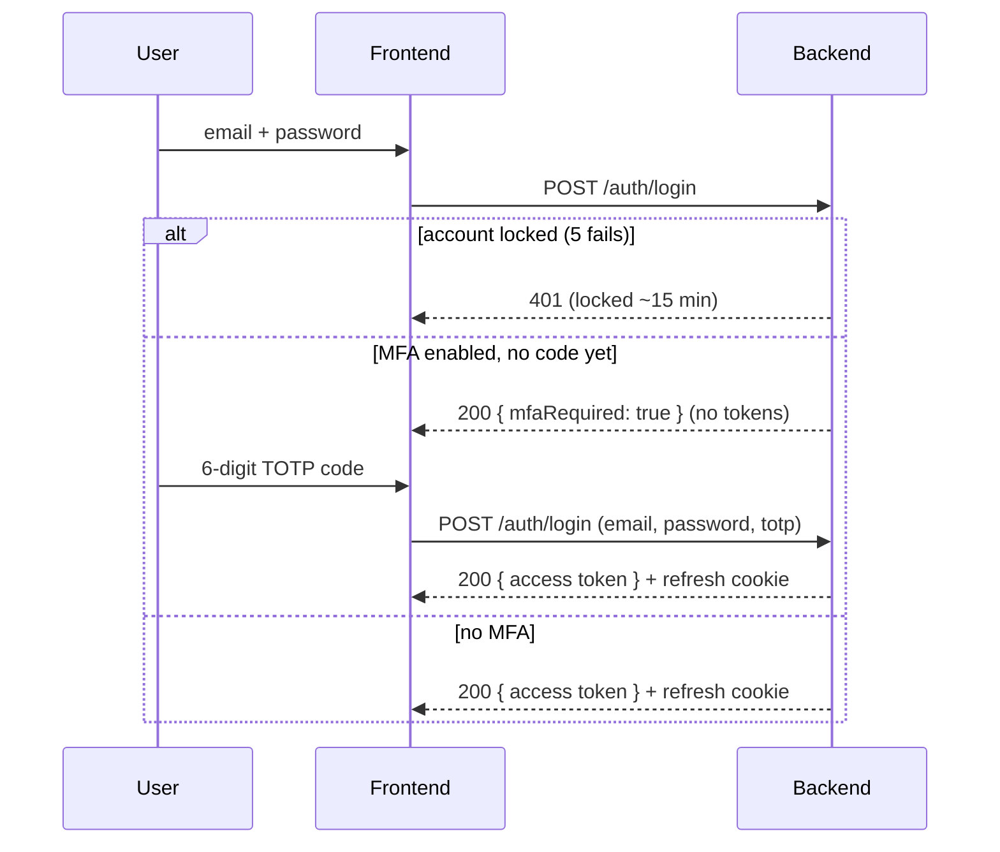

# 04 — Auth & Security

[← Data Model](03-data-model.md) · [Index](README.md) · [Next: Operations Core →](05-operations-core.md)

---

Security is not a feature bolted on — it's the guard chain from
[`02-architecture.md`](02-architecture.md) plus the mechanisms below. The system was
**pentested** (8 findings, all fixed) and passes a static consistency audit.

## 1. Tokens: short access + rotating refresh

Two-token scheme:

- **Access token** — a JWT signed with `JWT_ACCESS_SECRET`, short-lived
  (`JWT_ACCESS_EXPIRES_IN`, default **15m**), carried as a `Bearer` header. Validated
  by `JwtAuthGuard` (passport-jwt). Kept **in memory** on the client — never localStorage.
- **Refresh token** — long-lived (default **7d**), delivered as an **HttpOnly cookie**.
  Its format is `{id}.{secret}`; the DB stores only `SHA-256(secret)` in
  `RefreshToken.tokenHash`, compared with a **timing-safe** equality check. The
  refresh row also records `userAgent`, `ipAddress`, `lastUsedAt` — that's the
  session list.

**Rotation:** every refresh revokes the old token and issues a new one.

**Reuse detection (the important bit):** if a *revoked* refresh token is replayed
(a sign it was stolen), the system revokes the **entire token family** for that user,
writes an `AuditAction.TOKEN_REUSE_DETECTED` audit entry, and raises a notification.
Expired tokens are pruned opportunistically on login.

---

## 2. Login, MFA, and lockout

Login is potentially a **two-step** flow because of optional TOTP MFA:

- **Account lockout:** 5 failed attempts → `lockedUntil` = now + **15 minutes**
  (checked *before* the password compare, so it can't be used to probe). Success
  resets the counter. Audited as `ACCOUNT_LOCKED`.
- **MFA / TOTP** (`otplib`): user enrols in Security Settings — backend generates a
  base32 secret, returns an `otpauth://` QR; the user confirms one code to enable
  (`MFA_ENABLED`). Disable requires a valid code (`MFA_DISABLED`). When enabled,
  login step 1 returns `{ mfaRequired: true }` with **no tokens** until a valid code
  is supplied.
- **Note for tests/smoke:** a successful login returns **HTTP 200**, not 201.

---

## 3. Passwords & forced change

- **Policy** (`is-strong-password.validator`, mirrored in the frontend Zod schema):
  **12–128 characters, at least 3 of 4 classes** (lower/upper/digit/symbol), with a
  denylist. `bcrypt` hashing.
- **Self-service change** (`AccountService.changePassword`): verifies the current
  password, **blocks reuse**, revokes *other* sessions (keeps the current one),
  stamps `passwordChangedAt`, audits `PASSWORD_CHANGED`.
- **Admin reset / first login:** an admin reset sets `mustChangePassword=true` and
  revokes sessions. The global **`MustChangePasswordGuard`** then blocks every route
  except those marked `@AllowDuringPasswordChange()` (me, logout, change-password)
  until the user picks a new password. The very first admin login is forced through
  this too.

---

## 4. RBAC — 51 permissions, 10 roles

Access is **role → permissions**, deny-by-default. The `PermissionsGuard` requires a
route to declare its needs; a route that declares nothing is refused.

**The permission key shape** is `entity.action`, e.g. `jobs.view`, `invoices.approve`,
`assignments.override`, `jobs.costing_review`. The full set of **51** (verified from
the seed) spans view/manage/approve across every domain plus special ones like
`jobs.status_override`, `assignments.override`, `dashboard.finance.view`, `auth.me`.

**The 10 seeded roles** (`ROLE_PERMISSIONS` in `prisma/seed.ts`):

| Role | Gist |
|---|---|
| **Admin** | Everything. |
| **CEO/GM** | Broad read + finance visibility. |
| **Operations Manager** | Jobs, scheduling, approvals for field data. |
| **Finance Manager** | Estimates/invoices/payments/expenses incl. approve. |
| **Accountant** | Finance view + manage, no high-risk approvals. |
| **Field Supervisor** | Create field reports/timesheets/expenses (not approve own). |
| **Maintenance Manager** | Equipment/vehicle-leaning management + view. |
| **HR/Admin Officer** | People/admin data. |
| **Procurement Officer** | Contracts/POs-leaning. |
| **Viewer/Auditor** | Read-only across the board. |

> **The RBAC "triangle" is audited.** A consistency check proves that the set of
> permissions *required by code* = *seeded* = *granted to roles* = *known to the
> frontend*. No orphan permissions, no route requiring a permission that doesn't
> exist. See [`08-testing-quality.md`](08-testing-quality.md).

**Separation of duties** is enforced beyond RBAC: you cannot approve your **own**
timesheet, daily report, or expense — the service throws `403` even for Admin
(SRS 168). Details in [`07-edge-cases.md`](07-edge-cases.md).

---

## 5. Sessions

- **List** (`/auth/sessions`) — active refresh tokens with device/IP/last-used,
  current one flagged.
- **Revoke one** (`/auth/sessions/:id/revoke`) — audited `SESSION_REVOKED`.
- **Logout everywhere** (`/auth/logout-all`) — revokes all sessions (also triggered
  by password change for the *other* sessions).

The UI for this is `SecuritySettingsPage` (change password + MFA QR + session list).

---

## 6. Hardening summary (and the pentest)

| Control | Where |
|---|---|
| Security headers | Helmet (global) |
| Rate limiting | ThrottlerGuard 120/60s, tighter on costly endpoints (pentest P-07) |
| Swagger off in prod | `main.ts` gated on `NODE_ENV` (P-04) |
| Deny-by-default authz | `PermissionsGuard` (P-05 fail-open fixed) |
| No default admin password | Seed **requires** `ADMIN_PASSWORD`, fails fast if unset (P-01) |
| Refresh token hashed | SHA-256, secret never stored |
| Passwords | bcrypt + strong policy + reuse block |
| SQL injection | Prisma parameterised queries |
| Error disclosure | `HttpExceptionFilter` normalises errors (P-06) |
| Dependency DoS | `multer`/`js-yaml` pinned via `overrides` (P-02) |
| Secrets on disk | `.env.production` host-only, per-environment (P-08) |

All **8 pentest findings are fixed and re-verified** — details in
[`../audit/PENTEST.md`](../audit/PENTEST.md). Remaining owner actions live in
[`10-concerns-risks.md`](10-concerns-risks.md).

---

[← Data Model](03-data-model.md) · [Index](README.md) · [Next: Operations Core →](05-operations-core.md)
