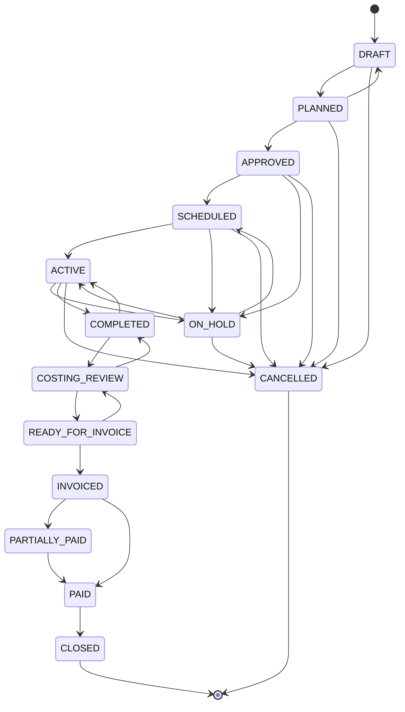

# 05 — Operations Core (Phase 1)

[← Auth & Security](04-auth-security.md) · [Index](README.md) · [Next: Finance →](06-finance.md)

---

Phase 1 is the operational backbone: the commercial setup, the job lifecycle, the
resources, and how they're scheduled. This is the left half of the job-to-cash chain.

## 1. Commercial setup: Client → Contract → PO

Before a job can exist, the commercial scaffolding must be in place:

- **Client** — the customer (e.g. Saudi Aramco), with type, VAT/CR numbers, billing
  address, and default payment terms.
- **Contract** — a master agreement with the client: `contractValue`, dates, status,
  and — crucially — a **rate card**.
- **ContractRateCard** — the agreed **price list**: each line is a service item with
  a fixed `unitPrice`. Estimates and invoices pull prices from here so quoting is
  consistent with the contract. (The real Aramco contract *6601000307* with 47 rate
  lines is seeded.)
- **PurchaseOrder** — a spending authorisation under the contract: `poValue` and a
  running `consumedAmount`. Issuing invoices draws the PO down; the system warns as
  it nears/exceeds the limit.

---

## 2. The Job status state machine

A Job walks a defined lifecycle. Transitions are **not** free-form — they're
declared in `backend/src/jobs/job-status.constants.ts` (`ALLOWED_TRANSITIONS`), and
any illegal move is rejected.

### Two drivers, one machine
The same transition table is driven by two different callers:

1. **User** — via the manual status-change endpoint (`jobs.status_change` permission).
2. **System** — `JobStatusService.applyFinanceStatus`, called by finance events
   (invoice issue → `INVOICED`; payment → `PARTIALLY_PAID`/`PAID`).

### The finance blocklist (memorise this)
Five statuses are in the transition table (so the *event-driven* path works) but are
**forbidden from the manual endpoint** via `MANUAL_STATUS_CHANGE_BLOCKLIST`:
`COSTING_REVIEW`, `READY_FOR_INVOICE`, `INVOICED`, `PARTIALLY_PAID`, `PAID`. You
cannot hand-set a job to "PAID" — only recording a payment can. This keeps the
financial state honest. Terminal states `CLOSED` and `CANCELLED` have no exits.

Every transition writes a **JobStatusHistory** row (from, to, who, reason). The full
review of this machine, including edge notes (re-opening a completed job, the close
gate), is in [`../audit/JOB-LIFECYCLE.md`](../audit/JOB-LIFECYCLE.md).

---

## 3. Resources

Four resource types, each its own table, each with a `costRate` for later profit math:

- **Employee** — role, department, availability, `costRate` (SAR/hr).
- **Crew** — a named team with a supervisor and **time-bounded members**
  (`CrewMember.startDate/endDate`), so costing only counts who was in the crew then.
- **Vehicle** — the real fleet sheet: Latin + **Arabic plate**, door number,
  LIGHT/HEAVY class, and a full set of **compliance expiries** (registration,
  insurance, GOV inspection/MVPI, operating card, **Aramco sticker**).
- **Equipment** — type, serial, calibration & maintenance due dates.

All four can carry **Documents** (certs, registration scans) with their own expiry.

---

## 4. Scheduling: assignments, conflicts, overrides

**Assignment** links a job to exactly one resource over a time window (see the
polymorphic pattern in [`03-data-model.md`](03-data-model.md)).

**Conflict detection** — when you assign a resource, the service checks for:
- **Window overlap** with an existing ACTIVE/COMPLETED assignment of that resource, and
- **Unavailable states** by type (Employee: `ON_LEAVE`/`SICK`/`INACTIVE`;
  Vehicle/Equipment: `MAINTENANCE`/`OUT_OF_SERVICE`; Crew: `INACTIVE`).

If a conflict is found, the assignment is **rejected (409)** — *unless* the caller
supplies an `overrideReason` **and** holds `assignments.override`. An override is
allowed but **audited** (`AuditAction.OVERRIDE` with the reason). Rescheduling over a
conflict needs the same override.

**Bulk assign** exists (`POST /assignments/bulk`) — attach several mixed resources to
one job sharing a window, transactionally, with one override reason covering the batch.

**Utilization** is computed from assignments against a weekday × 8h capacity model and
surfaced on the operations dashboard.

> Dropdown gotcha: option loaders must use `pageSize: 100` (the API max). `200` → 400
> → empty dropdown. See [`07-edge-cases.md`](07-edge-cases.md).

---

## 5. Documents & expiry

The **Document** module stores files (via `IStorageService`) against employees,
vehicles, equipment, contracts, or clients, each with an `expiryDate`. A helper
computes each document's status (valid / expiring / expired), and the system raises
`DOCUMENT_EXPIRING` / `DOCUMENT_EXPIRED` notifications — the compliance early-warning.
(Expenses store their receipts directly on the row, *not* in this module.)

---

## 6. Audit log & notifications

- **Audit log** — the `AuditLogInterceptor` + explicit service calls record CREATE/
  UPDATE/DELETE/STATUS_CHANGE/OVERRIDE/APPROVE/REJECT and the security events, with
  before/after JSON diffs, actor, and IP. Immutable; queryable in the Audit Logs page.
- **Notifications** — per-user in-app inbox (there is **no email/SMTP** yet). The
  topbar bell polls unread count every 60s. Finance alerts (S13) fan out here too.

---

## 7. Dashboards (operations & assets)

Two Phase-1 aggregation endpoints power the home dashboard:
`/dashboard/operations` (job status breakdown, top utilization, pending items) and
`/dashboard/assets`. Charts are largely **hand-rolled SVG** in
`frontend/src/components/charts.tsx` (donuts, bar breakdowns, utilization meters) with
a distinct categorical colour per job status. The finance dashboard is Phase 2 —
[`06-finance.md`](06-finance.md).

---

[← Auth & Security](04-auth-security.md) · [Index](README.md) · [Next: Finance →](06-finance.md)
