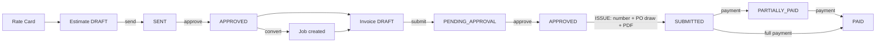

# 06 — Finance (Phase 2, S7–S13)

[← Operations Core](05-operations-core.md) · [Index](README.md) · [Next: Edge Cases →](07-edge-cases.md)

---

Phase 2 is the right half of the job-to-cash chain: quote → bill → collect, plus the
cost/profit and dashboard layer. All of it is **built and live**. The authoritative
sprint doc is [`../../PHASE2.md`](../../PHASE2.md); this is the teaching walk-through.

## 1. The money pipeline at a glance



Remember the **price vs. cost** split from [`03-data-model.md`](03-data-model.md):
estimates and invoices are all **price** (what the client pays); costing is all
**cost** (what Abrican spends). They only meet in the profit calculation.

---

## 2. Line math (the shared engine)

Every estimate and invoice line uses the same formula, in
`backend/src/common/finance/line-math.ts`:

```
lineSubtotal = round2(quantity × hours × unitPrice)   (hours defaults to 1)
lineVat      = round2(lineSubtotal × vatRate / 100)    (vatRate default 15)
lineTotal    = round2(lineSubtotal + lineVat)
```

Document totals sum the **already-rounded** line figures (`sumTotals`). VAT is
computed **per line**, not on the grand subtotal — this matches ZATCA expectations and
avoids halala drift. `round2()` adds `Number.EPSILON` to avoid the `1.005 → 1.00`
rounding bug. All amounts are computed **server-side and authoritative** — the client
never sends totals.

---

## 3. S7 — Estimates / quotations

Lifecycle: `DRAFT → SENT → APPROVED → CONVERTED` (plus `REJECTED`, `EXPIRED`).

- Lines can be **picked from the contract rate card** (fixed `unitPrice`, VAT locked)
  or entered custom. The lock is enforced **both in the UI and server-side** for
  contract lines.
- A quotation **PDF** is rendered (bilingual Arabic/English via Gotenberg).
- **Convert:** an `APPROVED` estimate becomes a **Job** — the estimate's `totalAmount`
  copies to `Job.jobValue`, `estimate.jobId` is set, and status becomes `CONVERTED`.
  An estimate can't be converted twice (guarded).

---

## 4. S8 — Invoicing

Lifecycle: `DRAFT → PENDING_APPROVAL → APPROVED → SUBMITTED` (then payments move it to
`PARTIALLY_PAID`/`PAID`; `CANCELLED` only before issue).

The critical step is **issue** (`APPROVED → SUBMITTED`), done in one atomic
transaction:

1. **Validate** the client's VAT number (required for a tax invoice).
2. **Check the PO balance.** If `invoice.total > PO remaining`, the issue is blocked
   **unless** an `overrideReason` is given by someone with `invoices.approve`; the PO's
   `consumedAmount` is then drawn down.
3. **Assign the official `invoiceNumber`** (`INV-YYYY-####`) — **only now**, not at
   draft (F-012). Deleted drafts leave no gap in the legal sequence.
4. **Advance the linked Job** to `INVOICED` (via `applyFinanceStatus`).
5. **Render and store the PDF snapshot** (`pdfUrl`) — immutable proof of what was
   issued, including the **ZATCA Phase-1 QR** (a Base64 TLV of seller name, VAT number,
   timestamp, total, VAT total → QR image) on tax invoices.

Concurrency is protected by a compare-and-swap on the invoice's `APPROVED` status —
two simultaneous issues can't both win. See [`07-edge-cases.md`](07-edge-cases.md).

Invoice lines carry **ACTUAL** quantity/hours (vs. the estimate's quoted figures) and
can trace back to the estimate line they came from.

---

## 5. S9 — Payments & receivables

- **Record a payment** against a `SUBMITTED`/`PARTIALLY_PAID` invoice. The amount
  must not exceed the outstanding balance. In one transaction the system increments
  `paidAmount`, recomputes `outstandingAmount`, flips the invoice to
  `PARTIALLY_PAID` or `PAID`, writes the `Payment` row, and advances the **Job** status.
- A **compare-and-swap on `paidAmount`** stops two concurrent payments from
  over-paying (edge case INV-D7-7).
- **AR aging** buckets receivables (current, 31–60, 61–90, 90+ days past due) for the
  Receivables page.

---

## 6. S10 — Daily reports & timesheets

Both share the `ApprovalStatus` workflow: `DRAFT → SUBMITTED → APPROVED / REJECTED`
(rejected can be resubmitted). Records are **editable only in DRAFT/REJECTED** — once
approved they lock (409 on edit). **You cannot approve your own** (self-approval block,
403). Approved **timesheets feed costing** (their hours × cost rate).

---

## 7. S11 — Expenses & reimbursement

- **Approval:** `DRAFT → SUBMITTED → APPROVED → POSTED` (POSTED = counts toward job
  cost). VAT auto-calculates at 15% of base (editable); totals computed server-side.
  Self-approval blocked (403, even Admin).
- **Allocation:** an expense can be tagged to a job / vehicle / equipment / employee
  (all optional — there is no Department model). An `unallocated` flag is surfaced but
  not blocking.
- **Receipts** are stored via `IStorageService` directly on the expense row
  (`receiptUrl`), *not* the Document module.
- **Reimbursement track** for out-of-pocket (reimbursable) expenses:
  `NOT_APPLICABLE → PENDING → COMPENSATED / DELAYED / DECLINED`. A per-employee
  Reimbursements worklist totals what's owed.

---

## 8. S12 — Job costing & profitability (the profit feature)

The `costing` module computes a job's **actual cost** and margin from three sources:

- **Labour** — approved timesheets: `regularHours × costRate`, plus overtime/standby/
  travel hours weighted by multipliers (in `costing.constants.ts`). Crew timesheets sum
  the cost rates of members active on that date.
- **Vehicle & equipment** — non-cancelled assignments: `actualHours × costRate`.
- **Expenses** — POSTED expenses allocated to the job, grouped by category.

Then:
```
revenue      = invoiced subtotal (ex-VAT) if the job has issued invoices,
               else job.jobValue (quoted)          [revenueBasis: INVOICED | JOB_VALUE | NONE]
grossProfit  = revenue − actualCost
grossMarginPct = grossProfit / revenue × 100        (null if revenue = 0)
costVariance = actualCost − costBudget               (null if no budget)
```

Running the **cost review** persists `actualCost`/`grossProfit`/`grossMarginPct`/
`costReviewedAt/By` onto the Job, advances it to `COSTING_REVIEW`, and fires alerts
(below). Costing is visible on the job page under `jobs.costing_view` /
`jobs.costing_review`. Resources missing a `costRate` are flagged with a warning
rather than silently costing zero.

---

## 9. S13 — Finance dashboard & alerts

**Finance dashboard** (`GET /dashboard/finance`, `dashboard.finance.view`): billed
revenue & output VAT, cash collected, receivables/overdue (reuses aging), realised
gross profit & average margin, expenses by category, net VAT, unbilled completed work,
and the invoice-status pipeline — all over a date window.

**Critical finance alerts** (`finance-alerts` module) — in-app notifications
(no email yet), event-triggered plus a daily cron sweep:

| Trigger | Alert |
|---|---|
| Invoice issued > PO balance | `INVOICE_EXCEEDS_PO` |
| PO ≥ 90% consumed on issue | `PO_NEARLY_CONSUMED` |
| Cost review over budget | `COST_OVER_BUDGET` |
| Margin below target (10%) | `MARGIN_BELOW_TARGET` |
| Daily sweep: invoice past due | `INVOICE_OVERDUE` |
| Daily sweep: completed but unbilled > 7 days | `JOB_NOT_INVOICED` |
| Daily sweep: submitted/partly-paid invoices | `PAYMENT_DELAYED` |

Alerts fan out to permission-holders with an unread-duplicate guard, and are
**best-effort** — a failing alert never blocks the operation that triggered it.

> Thresholds (margin **10%**, PO **90%**, unbilled **7 days**, and the overtime/standby/
> travel multipliers) are **assumptions in constants files** — confirm them with
> Finance during UAT. See [`10-concerns-risks.md`](10-concerns-risks.md).

---

[← Operations Core](05-operations-core.md) · [Index](README.md) · [Next: Edge Cases →](07-edge-cases.md)
