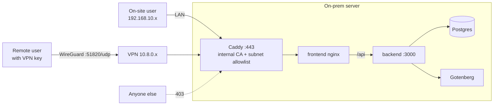

# 09 — Running & Deploying

[← Testing & Quality](08-testing-quality.md) · [Index](README.md) · [Next: Concerns & Risks →](10-concerns-risks.md)

---

Three Docker Compose stacks exist for three purposes. This chapter explains which is
which, and records the **current deployment plan**. The step-by-step on-prem runbook is
[`../SELF-HOSTING.md`](../SELF-HOSTING.md); the generic prod guide is
[`../../DEPLOYMENT.md`](../../DEPLOYMENT.md).

## 1. The three stacks

| File | Purpose | Services & ports | TLS / PDF |
|---|---|---|---|
| `docker-compose.yml` | **Local dev** (two origins) | db `:5434`, backend `:3000`, frontend/Vite `:5173`, **gotenberg** (internal) | none / Gotenberg ✅ |
| `docker-compose.prod.yml` | **Production base** (same-origin, internal-only) | db + backend **not published**; frontend/nginx `:80` | external TLS / **⚠ no Gotenberg** |
| `deploy/docker-compose.tls.yml` | **Self-hosting overlay** (applied *on top of* prod) | adds **gotenberg** + logo mount + **Caddy** `:443` (internal CA), unpublishes frontend | Caddy internal TLS / Gotenberg ✅ |

> **⚠ The single most important deployment fact:** the **base prod file omits
> Gotenberg**. Run it alone and invoice/quotation PDFs fail (and have no logo). The
> self-hosting overlay fixes this — so for a real self-hosted deployment you **always**
> include *both* `-f` files:
> ```bash
> docker compose -f docker-compose.prod.yml -f deploy/docker-compose.tls.yml \
>   --env-file .env.production up -d --build
> ```

**Same-origin** everywhere in prod: nginx serves the SPA and proxies `/api` to the
backend, so the `Secure`+`SameSite=Lax` refresh cookie works. The DB and backend never
publish a port.

---

## 2. The self-hosting topology (the intended production shape)

The design: **on-premise, no public web exposure**. Staff reach it on the office LAN;
remote staff over **WireGuard VPN**. Caddy terminates internal TLS and rejects any
source IP outside the allowlisted LAN/VPN subnets (403). Three filters stack: network
allowlist → VPN key → application account/RBAC.



Supporting files: `deploy/Caddyfile` (hostname + the two allowlisted CIDRs),
`deploy/backup.sh` (nightly DB dump + storage tarball), and `.env.production`
(all secrets, host-only, git-ignored).

---

## 3. Key environment variables (`.env.production`)

| Var | Notes |
|---|---|
| `POSTGRES_PASSWORD` | also paste into `DATABASE_URL` |
| `DATABASE_URL` | must use internal host `db:5432` |
| `JWT_ACCESS_SECRET`, `JWT_REFRESH_SECRET` | `openssl rand -hex 32` each; never reuse dev values |
| `ADMIN_EMAIL`, `ADMIN_PASSWORD` | **required** on fresh seed — seed fails fast if unset (no default) |
| `SEED_ON_START` | `true` first boot; set `false` afterwards |
| `CORS_ORIGINS`, `VITE_API_BASE_URL` | public origin / `/api/v1` |
| `SERVER_LAN_IP`, `HTTP_PORT` | used by the TLS overlay (Caddy binds to the LAN IP only) |

On first boot the backend runs `prisma migrate deploy`, then seeds the RBAC catalogue +
admin (idempotent). Back up the `db_data` and `backend_storage` volumes.

---

## 4. Current deployment plan (from the recent working session)

The target server is a **Windows Server 2019 Standard** box with **no Docker yet**. Key
constraint: this stack is **Linux containers** (alpine Postgres, Node, nginx, Gotenberg,
Caddy) — Windows Server 2019 can't run those natively/reliably (Docker Desktop isn't
supported there; WSL2 is shaky on that build). **Decision taken: run a Linux VM.**

The plan:
1. **Enable Hyper-V** on the Windows host (`Install-WindowsFeature -Name Hyper-V …`).
2. Create an **External** virtual switch (bridges the VM onto the office LAN → it gets
   its own LAN IP; keeps WireGuard port-forwarding simple).
3. Create an **Ubuntu Server 24.04 LTS** VM (4 vCPU / 8 GB static RAM / 100 GB on SSD;
   Gen 2 with the *Microsoft UEFI Certificate Authority* secure-boot template).
4. **Inside the VM, follow [`../SELF-HOSTING.md`](../SELF-HOSTING.md) verbatim** — it
   assumes Ubuntu 24.04. Zero repo changes needed.

Status: **planned, not yet executed.** The system has **never been deployed to a real
server** — see [`10-concerns-risks.md`](10-concerns-risks.md).

---

## 5. Everyday operations (inside the VM)

```bash
# alias to save typing:
alias dc='docker compose -f docker-compose.prod.yml -f deploy/docker-compose.tls.yml --env-file .env.production'

dc ps                 # status
dc logs -f backend    # logs
dc up -d --build      # deploy new code (runs new migrations on boot)
# backup (also copy OFF the box!):
dc exec db pg_dump -U abrican abrican_erp > backup_$(date +%F).sql
```

Take a backup **before** every update, and **copy backups off the box** — an on-box
backup doesn't survive a disk failure.

---

[← Testing & Quality](08-testing-quality.md) · [Index](README.md) · [Next: Concerns & Risks →](10-concerns-risks.md)
