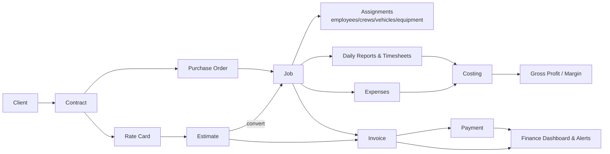

# Abrican ERP — Study-Book

A self-contained guide to **re-learn the entire Abrican ERP system from scratch**.
If you have been away from the project and forgotten how it works, start here and
read straight through. You should not need any other document open — but every
chapter links to the deeper, authoritative sources when you want more.

> **What this is vs. what `PROJECT-STATUS.md` is**
> - This study-book is the **durable teaching doc**: what the system is, why it's
>   built the way it is, how each part works. It changes slowly.
> - [`../PROJECT-STATUS.md`](../PROJECT-STATUS.md) is the **living status doc**:
>   what's done, what's next, current risks. Check that for "where are we today".

---

## How to use this book

- **Coming back cold?** Read `00` → `01` → `02` in order to rebuild the mental model,
  then dip into whichever domain you need.
- **Need to change finance code?** Read `03` (data model) + `06` (finance) + `07` (edge cases).
- **Deploying?** Read `09`, then follow [`../SELF-HOSTING.md`](../SELF-HOSTING.md).
- **Testing recall?** Jump to `11` (self-quiz) and see how much you remember.
- **Hit an unfamiliar term?** `12` (glossary) defines every domain + technical word.

Every factual claim in this book was **verified against the code** on 2026-08-11
(models/enums counted from the schema, versions from `package.json`, transitions
from the actual constants files). Nothing here is assumed.

---

## Table of contents

| # | Chapter | What you'll learn |
|---|---------|-------------------|
| — | [README](README.md) | This index + the verified fact sheet |
| 00 | [The Idea & Business Domain](00-the-idea.md) | Who Abrican is, the problem, the "Job" as the heart of the system, the job-to-cash chain, and how the system was built (sprint by sprint) |
| 01 | [Tech Stack & Languages](01-tech-stack.md) | Every language, framework, and library — and *why* each was chosen |
| 02 | [Architecture](02-architecture.md) | Modular monolith, request lifecycle, the guard chain, the frontend SPA, and the same-origin topology |
| 03 | [Data Model](03-data-model.md) | All 29 tables, all 27 enums, the relationships (ER diagram), and the money/polymorphic conventions |
| 04 | [Auth & Security](04-auth-security.md) | JWT + refresh rotation, MFA, lockout, RBAC (51 permissions / 10 roles), and the hardening story |
| 05 | [Operations Core (Phase 1)](05-operations-core.md) | Clients → contracts → POs → jobs, the job state machine, resources, scheduling, documents, dashboards |
| 06 | [Finance (Phase 2, S7–S13)](06-finance.md) | Estimates → invoices → payments, costing math, the finance dashboard, and finance alerts |
| 07 | [Edge Cases & Gotchas](07-edge-cases.md) | Race conditions, invoice numbering, self-approval blocks, rounding, and the dev traps |
| 08 | [Testing & Quality Gates](08-testing-quality.md) | The three test suites, the consistency audit, the audit artifacts, and CI |
| 09 | [Running & Deploying](09-deployment.md) | Dev vs prod vs self-hosting stacks, and the current Windows-Server/Hyper-V plan |
| 10 | [Concerns & Deferred Work](10-concerns-risks.md) | The candid risk list and the complete "not built yet" inventory |
| 11 | [Questions To Ask Yourself](11-self-quiz.md) | A self-quiz with answers, per topic, to test your recall |
| 12 | [Glossary](12-glossary.md) | Every domain and technical term defined |

---

## Verified fact sheet (the 60-second refresher)

| Thing | Value |
|---|---|
| **What it is** | An operations-to-finance ERP for **Abrican**, a Saudi oil-&-gas / industrial-services contractor (Aramco vendor) |
| **Central object** | The **Job** — everything hangs off the job-to-cash chain |
| **Language** | **TypeScript end-to-end** (backend + frontend) |
| **Backend** | NestJS 11 · Prisma 5 · PostgreSQL 16 (modular monolith) |
| **Frontend** | React 19 · Vite 8 · Tailwind v4 · Radix/shadcn · TanStack Query/Table · React Hook Form + Zod |
| **PDF / infra** | Gotenberg (HTML→PDF) · Docker Compose · Caddy (TLS) |
| **Data model** | **29 Prisma models · 27 enums · 10 migrations** |
| **Access control** | **51 permissions · 10 roles**, deny-by-default RBAC |
| **Tests** | **212 backend unit · 34 e2e · 28 frontend** — all green; consistency audit **0 findings** |
| **Security** | 8 pentest findings — **all fixed**; F-001…F-012 logic findings — **all closed** |
| **Phase status** | Phase 1 (operations) ✅ · Phase 2 (finance S7–S13) ✅ · Phase 3 planned |
| **Deployment** | **Never deployed to a real server yet** — the current plan is a Hyper-V Ubuntu VM on a Windows Server 2019 host (see `09`) |

---

## The whole system in one picture

Read [`00-the-idea.md`](00-the-idea.md) next.
